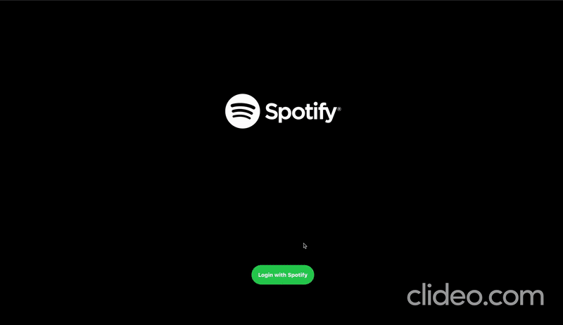

## Project Overview

A react-based <code>Spotify UI clone</code> application using Spotify APIs for 
- <code>authentication</code> 
- <code>User details</code> 
- <code>getting playlists</code>
- <code>getting personal discover weekly</code>

#### Note: Search results are pre-loaded in <code>src > utils > data.json</code> for development purpose. For real-time results follow the below steps

## Demo

## Project Setup

<ul>

### Clone the project 

<code>git clone https://github.com/dineshnadimpalli/React-Spotify-UI-Clone.git</code>
  

### Install Dependencies

Enter the project directory and do

<code>npm install (or) npm i</code>
  

### Run the application

<code>npm start</code>

This will run the project in http://localhost:3000
  

### Create a Spotify Application

Follow this guide <a>https://developer.spotify.com/documentation/general/guides/app-settings</a> to create a spotify application in <a>developer.spotify.com</a> for using Spotify APIs
  

### Edit Settings

Click on <code>Edit settings</code> in your Spotify application and set redirect url as <a>http://localhost:3000</a> also copy the <code>Client ID</code> and paste it in the <code>src > utils > spotify.js</code>
  

### One Last Step

Finally, modify the code in the <code>src > utils > spotify.js</code> and <code>src > App.js</code> accordingly and you are code is ready for launch 🚀

</ul>

  

## Happy Coding... 👨🏻‍💻✌️

  

## Resource Links

- https://developer.spotify.com/documentation/web-playback-sdk/quick-start/
- https://developer.spotify.com/documentation/general/guides/scopes/

